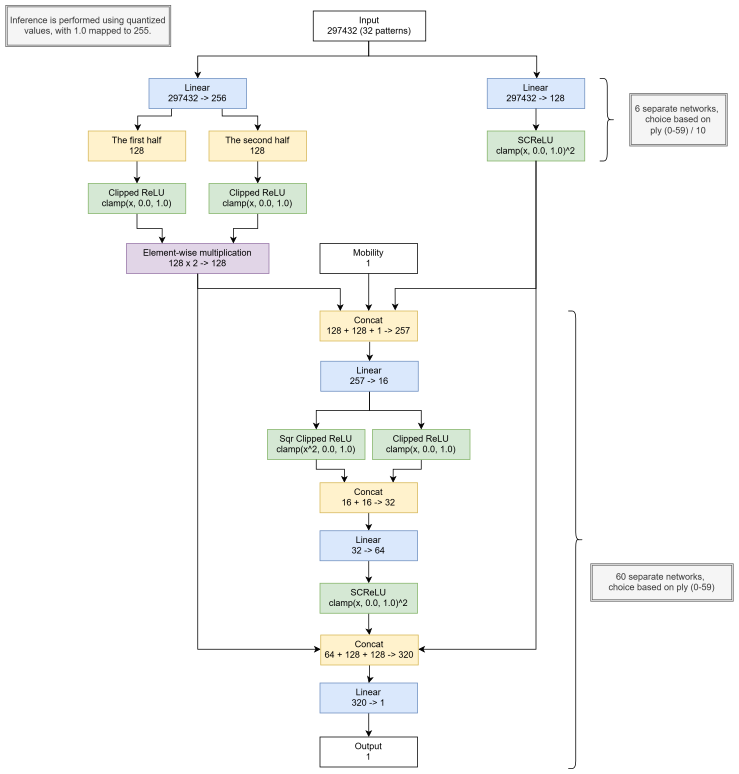
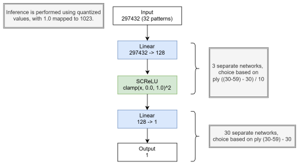

# Neural Reversi

[](https://github.com/natsutteatsuiyone/neural-reversi/actions/workflows/test.yml)
[](LICENSE)

This is an experimental project to develop a highly accurate neural network evaluation function for Reversi (Othello).

**[Play online (Lite version)](https://neural-reversi.net/)**

## Features

- Neural network-based position evaluation
- High-performance multi-threaded search
- Supports CLI, desktop GUI (Tauri), and WebAssembly

## Benchmarks (v6.3.0)

### Environment

- **CPU:** AMD Ryzen 9 9950X3D
- **Threads:** 32
- **Hash size:** 2048 MB
- **CPB (Core Performance Boost):** disabled unless noted

### Evaluation Accuracy

| Test | Problems | Depth | Time | Nodes | NPS | Best Move | Score ±3 | MAE |
|:--|:-:|:-:|--:|--:|--:|--:|--:|--:|
| [Hard-30](docs/6.3.0/benchmarks/hard-30-depth15.md) | 289 | 15 | 2.448s | 130,053,393 | 53,124,216 | 80.3% | 85.5% | 1.67 |

### Endgame Solving

| Test | Problems | Depth | Time | Nodes | NPS |
|:--|:-:|:-:|--:|--:|--:|
| [FFO #40–59](docs/6.3.0/benchmarks/fforum-40-59.md) | 20 | 20–34 | 6.029s | 12,791,069,853 | 2,121,636,861 |
| [FFO #40–59 (CPB Enabled)](docs/6.3.0/benchmarks/fforum-40-59.md) | 20 | 20–34 | 5.370s | 12,736,659,249 | 2,371,617,478 |
| [FFO #60–79](docs/6.3.0/benchmarks/fforum-60-79.md) | 20 | 24–36 | 184.418s | 334,416,880,379 | 1,813,367,928 |
| [FFO #60–79 (CPB Enabled)](docs/6.3.0/benchmarks/fforum-60-79.md) | 20 | 24–36 | 164.525s | 332,545,645,155 | 2,021,247,959 |
| [Hard-20](docs/6.3.0/benchmarks/hard-20.md) | 276 | 20 | 1.795s | 1,493,278,814 | 831,810,015 |
| [Hard-25](docs/6.3.0/benchmarks/hard-25.md) | 311 | 25 | 24.473s | 46,422,669,177 | 1,896,910,314 |
| [Hard-30](docs/6.3.0/benchmarks/hard-30.md) | 289 | 30 | 746.719s | 1,501,762,723,900 | 2,011,149,287 |
| [Small-35](docs/6.3.0/benchmarks/small-35.md) | 30 | 35 | 8,314.563s | 14,770,436,809,931 | 1,776,453,780 |

## Getting Started

### Prerequisites

- [Rust](https://www.rust-lang.org/tools/install)
- [cargo-make](https://github.com/sagiegurari/cargo-make) (recommended)
- [Bun](https://bun.sh/) (for GUI and Web development)

### Setup

1. Clone the repository:
   ```bash
   git clone https://github.com/natsutteatsuiyone/neural-reversi.git
   cd neural-reversi
   ```

2. Download the neural network weight files from the [latest release](https://github.com/natsutteatsuiyone/neural-reversi-weights/releases/latest)
   and place them in the project root directory:
   - `eval-*.zst`
   - `eval_sm-*.zst`
   - `eval_wasm-*.zst`

3. Run the interface you want to use:
   ```bash
   cargo run -p cli --release    # Play in the terminal (TUI)
   ```

   ```bash
   cd crates/gui
   bun install
   bun run tauri dev             # Launch the desktop GUI in development mode
   ```

   ```bash
   cd crates/web
   bun install
   bun run dev                   # Start the web version in development mode
   ```

### Large pages

Large pages can improve search performance by reducing memory-translation
overhead for the transposition table and other large buffers.

On Windows, follow Microsoft's [Lock pages in memory setup instructions](https://learn.microsoft.com/en-us/sql/database-engine/configure-windows/enable-the-lock-pages-in-memory-option-windows).
Without this privilege, the engine silently falls back to regular pages.

On Linux, Transparent Huge Pages are used automatically via `madvise`;
no setup or special privilege is needed, as long as the kernel's THP mode
allows `madvise` requests.

## Crates

- **[reversi-core](crates/reversi-core/)**: Core library implementing the AI search algorithms.
- **[cli](crates/cli/)**: Command-line interface for playing Reversi.
- **[gui](crates/gui/)**: Tauri-based graphical user interface for playing Reversi.
- **[web](crates/web/)**: WebAssembly build of the Rust engine, packaged with wasm-pack and Vite, and used as the frontend bundle for [neural-reversi.net](https://neural-reversi.net).
- **[match-runner](crates/match-runner/)**: Tool for automatically running matches between Reversi engines supporting the Go Text Protocol.
- **[datagen](crates/datagen/)**: Tool for generating neural network training data, including self-play games and feature extraction.
- **[evaltest](crates/evaltest/)**: Evaluation test suite runner for benchmarking engine performance using OBF problem files (FFO Forum, Edax hard sets).

## Neural Network

### Architecture

#### Midgame



#### Endgame



### Features

- Mobility: The number of legal moves for the current player.
- Patterns:  
  

### Training

[neural-reversi-training](https://github.com/natsutteatsuiyone/neural-reversi-training)

## Build

All builds are driven by [cargo-make](https://github.com/sagiegurari/cargo-make) and emit artifacts under `dist/`. The macOS GUI build produces a `.dmg` installer (requires building on macOS).

### Prerequisites

1. Install cargo-make:

   ```bash
   cargo install --force cargo-make
   ```

2. Download the neural network weight files from the [latest release](https://github.com/natsutteatsuiyone/neural-reversi-weights/releases/latest)
   and place them in the project root directory:
   - `eval-*.zst`
   - `eval_sm-*.zst`
   - `eval_wasm-*.zst`

### Distribution builds

Use one task for every binary, platform, and CPU tier:

```text
cargo make build-dist <cli|gui|all> <windows|linux|macos|all> <portable|native|x86-64-v2|x86-64-v3|x86-64-v4|apple-m1>
```

`native` optimizes for the build host. `portable` expands to `x86-64-v2`/`x86-64-v3`/`x86-64-v4` on Windows and Linux, and `apple-m1` on macOS. Builds are emitted under `dist/`; the macOS GUI build produces a `.dmg` and must run on macOS.

```bash
# Native CLI and GUI for Windows
cargo make build-dist all windows native

# All portable Windows CLI tiers
cargo make build-dist cli windows portable

# One AVX2-tier Linux GUI
cargo make build-dist gui linux x86-64-v3

# Apple Silicon CLI and GUI
cargo make build-dist all macos apple-m1
```

## License

This project is licensed under the [GNU General Public License v3 (GPL v3)](LICENSE). By using or contributing to this project, you agree to comply with the terms of the license.

Neural Reversi includes code originally licensed under GPL v3 from the following projects:

- **[Edax](https://github.com/abulmo/edax-reversi)**
- **[Stockfish](https://github.com/official-stockfish/Stockfish)**
